# IDEA.md — Swapping the encoder to an OCR-pretrained one (TrOCR)

## The core idea (in one line)

Replace the ImageNet-pretrained ViT-Tiny encoder with the pretrained
encoder from **TrOCR** (Microsoft) — a model literally pretrained to *read
text out of images* — while keeping our own small, Mermaid-specific
decoder (TrOCR's own decoder just outputs plain English, not Mermaid
syntax, so it's discarded).

This is architecturally different from "copy some weights out of
DeepSeek-OCR's middle layers," which doesn't work (dimension mismatch +
layers that were jointly trained with their specific neighbors, not
swappable in isolation — like a transplanted organ with no matched donor).
Swapping a **whole encoder** for another whole encoder is standard,
well-supported transfer learning — it's the same move as using
ImageNet-pretrained ViT-Tiny, just with a *domain-matched* pretrained
encoder instead of a generic one. TrOCR ships in HuggingFace `transformers`
specifically as a separable `encoder` + `decoder` pair, so this requires no
surgery — `VisionEncoderDecoderModel.from_pretrained(...).encoder` gives us
exactly the piece we want.

## Why TrOCR specifically (not DeepSeek-OCR)

| | DeepSeek-OCR | TrOCR |
|---|---|---|
| Encoder pretraining | general documents/images | **hundreds of millions of synthetic printed text lines** — directly the "read labels accurately" skill Mermaid diagrams need |
| Framework | PyTorch, but a newer/heavier 3B MoE model — more integration risk | PyTorch, mature, built into `transformers` as a standard `VisionEncoderDecoderModel` |
| Encoder extractable cleanly? | Likely, but not documented as a first-class workflow | Yes — this is exactly how TrOCR is designed to be used/swapped |
| Size (encoder only) | ~380M ("DeepEncoder") | 22M (DeiT-Small) or 86M (BEiT-Base) |

Given the goal is "strong OCR foundation, PyTorch-native, low integration
risk, size is now a secondary concern," TrOCR's encoder is the better fit.
DeepSeek-OCR-based distillation (teacher → student, discussed earlier)
remains a good *complementary* follow-up for generalizing beyond
mermaid-cli's rendering style, on real-world images — it's not required
for this change to work, and can be layered in later without touching this
decision.

## Architecture

```mermaid
flowchart TD
    subgraph INPUT["Input"]
        IMG["Diagram image (PNG/JPG)<br/>384x384, padded to square"]
    end

    subgraph ENCODER["Encoder — from TrOCR (Config B: BEiT-Base)"]
        direction TB
        PATCH["Patch embedding<br/>16x16 patches, 768-dim<br/>0.59M params"]
        POS["Position embeddings<br/>0.44M params"]
        B0["Block 0"]
        B1["Block 1"]
        B2["Block 2"]
        B3["Block 3"]
        B4["Block 4"]
        B5["Block 5"]
        B6["Block 6"]
        B7["Block 7"]
        B8["Block 8"]
        B9["Block 9"]
        B10["Block 10"]
        B11["Block 11"]
        LN["Final LayerNorm"]

        PATCH --> POS --> B0 --> B1 --> B2 --> B3 --> B4 --> B5 --> B6 --> B7 --> B8 --> B9 --> B10 --> B11 --> LN
    end

    subgraph PROJ["Projection"]
        P["Linear 768 -> 384<br/>0.29M params, train from scratch"]
    end

    subgraph DECODER["Decoder — custom, train from scratch"]
        direction TB
        TOK["Token + position embeddings<br/>2.55M params"]
        D0["Decoder layer 0<br/>(self-attn + cross-attn + FFN)"]
        D1["Decoder layer 1"]
        D2["Decoder layer 2"]
        D3["Decoder layer 3"]
        D4["Decoder layer 4"]
        D5["Decoder layer 5"]
        OUT["Output projection -> vocab (6000)<br/>2.30M params"]
        TOK --> D0 --> D1 --> D2 --> D3 --> D4 --> D5 --> OUT
    end

    IMG --> PATCH
    LN --> P --> D0
    OUT --> CODE["Generated Mermaid code<br/>(autoregressive, one token at a time)"]

    style PATCH fill:#e0e0e0,stroke:#888
    style POS fill:#e0e0e0,stroke:#888
    style B0 fill:#e0e0e0,stroke:#888
    style B1 fill:#e0e0e0,stroke:#888
    style B2 fill:#e0e0e0,stroke:#888
    style B3 fill:#e0e0e0,stroke:#888
    style B4 fill:#c8e6c9,stroke:#2e7d32
    style B5 fill:#c8e6c9,stroke:#2e7d32
    style B6 fill:#c8e6c9,stroke:#2e7d32
    style B7 fill:#c8e6c9,stroke:#2e7d32
    style B8 fill:#c8e6c9,stroke:#2e7d32
    style B9 fill:#c8e6c9,stroke:#2e7d32
    style B10 fill:#c8e6c9,stroke:#2e7d32
    style B11 fill:#c8e6c9,stroke:#2e7d32
    style LN fill:#c8e6c9,stroke:#2e7d32
    style P fill:#bbdefb,stroke:#1565c0
    style TOK fill:#bbdefb,stroke:#1565c0
    style D0 fill:#bbdefb,stroke:#1565c0
    style D1 fill:#bbdefb,stroke:#1565c0
    style D2 fill:#bbdefb,stroke:#1565c0
    style D3 fill:#bbdefb,stroke:#1565c0
    style D4 fill:#bbdefb,stroke:#1565c0
    style D5 fill:#bbdefb,stroke:#1565c0
    style OUT fill:#bbdefb,stroke:#1565c0
```

**Legend**: grey = frozen (weights loaded from TrOCR, not updated) · green =
loaded from TrOCR but fine-tuned (small learning rate) · blue = trained
from scratch (normal/higher learning rate).

## Frozen vs. trainable — exact layer list

| Component | Source | Status | Learning rate |
|---|---|---|---|
| Patch embedding | TrOCR (BEiT-Base) | **Frozen** | — |
| Position embeddings | TrOCR (BEiT-Base) | **Frozen** | — |
| Encoder blocks 0–3 (bottom 4 of 12) | TrOCR (BEiT-Base) | **Frozen** | — |
| Encoder blocks 4–11 (top 8 of 12) | TrOCR (BEiT-Base) | Fine-tuned | low (e.g. 1e-5) |
| Encoder final LayerNorm | TrOCR (BEiT-Base) | Fine-tuned | low (e.g. 1e-5) |
| Projection (768→384) | — | **Trained from scratch** | normal (e.g. 3e-4) |
| Decoder (6 layers) | — | **Trained from scratch** | normal (e.g. 3e-4) |
| Output vocab head | — | **Trained from scratch** | normal (e.g. 3e-4) |

**Why freeze the bottom 4 blocks specifically**: the standard finding across
transfer learning literature (true for CNNs and transformers alike) is that
early layers learn generic, low-level features (edges, textures, basic
shape detectors) that transfer almost unchanged across domains, while later
layers encode more task/domain-specific abstractions. Freezing the bottom
third preserves TrOCR's low-level "this is a stroke of ink" features
untouched (cheap, safe, less overfitting risk with our comparatively small
dataset) while letting the top two-thirds adapt to Mermaid's specific
visual style (node shapes, arrow styles, the 11 themes). This 4-frozen/8-tuned
split is a reasonable starting default, not a law — if training results
show the encoder isn't adapting enough, unfreezing more blocks (or all of
them) is the first thing to try; if it's overfitting, freezing more is the
first thing to try.

**Why a differential learning rate on the unfrozen encoder blocks**: those
weights already encode useful structure; a normal learning rate risks
wrecking that in the first few hundred steps before the still-randomly-initialized
decoder has learned anything useful to backpropagate a sensible gradient
through. A low LR lets the encoder drift gently toward Mermaid-specific
features instead of getting knocked out of its pretrained optimum early.

## Size analysis

All figures below are calculated directly from the published architecture
configs (standard transformer parameter-counting formulas: `12 * d_model^2`
per encoder block, patch/position embedding sizes from patch count, etc.)
and cross-checked against the commonly cited ~22M (DeiT-Small) and ~86M
(BEiT-Base) figures in the literature. They have **not** been measured on
an actual loaded checkpoint in my sandbox (no disk space for a `torch` +
`transformers` install here — see README "What's tested").

| Component | Config A (DeiT-Small) | Config B (BEiT-Base) |
|---|---|---|
| Encoder — patch embed | 0.29M | 0.59M |
| Encoder — position embed | 0.22M | 0.44M |
| Encoder — 12 transformer blocks | 21.23M | 84.93M |
| **Encoder total** | **21.75M** | **85.97M** |
| Projection (only needed if dims differ) | 0 (384=384, `nn.Identity`) | 0.29M |
| Decoder — token+pos embeddings | 2.55M | 2.55M |
| Decoder — 6 transformer layers | 14.16M | 14.16M |
| Decoder — output vocab head | 2.30M | 2.30M |
| **Decoder total** | **19.01M** | **19.01M** |
| **Grand total** | **40.76M** | **105.27M** |
| fp32 size | 155.5 MB | 401.6 MB |
| fp16 size | 77.7 MB | 200.8 MB |

**Frozen vs. trainable parameter split (Config B)**:

| | Params | Share of total |
|---|---|---|
| Frozen (patch embed + pos embed + blocks 0–3) | 28.94M | 27.5% |
| Trainable — encoder (blocks 4–11 + final LN) | 56.62M | 53.8% |
| Trainable — projection + decoder | 19.30M | 18.3% |
| **Total trainable** | **76.33M (72.5%)** | |

**Recommendation**: start with **Config B (BEiT-Base)** since accuracy is
the stated priority and size is secondary. Config A (DeiT-Small) is noted
as a fallback if training turns out to be too slow/memory-hungry on your
hardware, or if Config B overfits the current dataset size — same
architecture shape, just smaller.

## Note for open-weighting + ONNX export (your stated plan)

Both configs use only standard, widely-supported ops (`nn.MultiheadAttention`
via `nn.TransformerDecoderLayer`, standard conv-based patch embedding,
learned position embeddings) — no custom CUDA kernels or exotic
architectural tricks that would complicate `torch.onnx.export` later. The
one thing worth deciding *before* export: whether to keep greedy decoding
(simple, exports cleanly step-by-step) or add beam search (better quality,
more involved to export as a static graph — usually done by exporting the
encoder and one decoder step separately, then driving the loop in whatever
runtime hosts the ONNX model). No action needed from me on this now; flagging
it so it doesn't surprise you at export time.

## What I'll change in the code to match this doc

- `model.py`: swap `timm.create_model('vit_tiny_patch16_224', ...)` for
  `transformers.VisionEncoderDecoderModel.from_pretrained('microsoft/trocr-base-stage1').encoder`,
  discard its decoder, keep our custom decoder as-is (just bump `d_model`
  to 384 and `decoder_layers` to 6 to match the sizing above).
- Freeze/unfreeze logic: a `freeze_encoder_layers(model, n=4)` helper that
  sets `requires_grad=False` on patch embedding + position embeddings +
  the first `n` encoder blocks.
- `train_reconstructor.py`: split the optimizer into two parameter groups
  (encoder-unfrozen vs. everything-else) with the two learning rates from
  the table above.
- `requirements.txt`: add `transformers`, drop `timm` (no longer used once
  the encoder comes from `transformers` instead).
