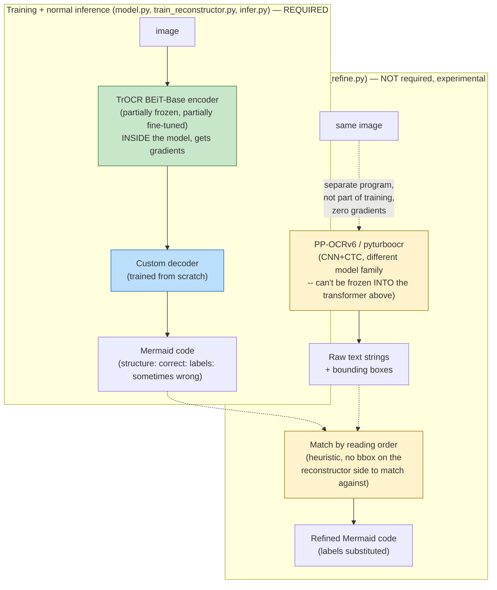

# IDEA.md — Swapping the encoder to an OCR-pretrained one (TrOCR)

## STATUS & HANDOFF — read this first if you're a new session

This doc grew out of a long conversation. If you're picking this up fresh
(new chat, no memory of how we got here), start here.

**What's built and working**: the full pipeline in this repo
(`common/diagram_generators.py` -> `generate_dataset.py` ->
`train_tokenizer.py` -> `train_router.py`/`train_reconstructor.py` ->
`infer.py`) runs. Architecture: MobileNetV3-Small router (30 classes: 29
Mermaid diagram types + "not a diagram") + a TrOCR-BEiT-Base-encoder /
custom-decoder reconstructor for image -> Mermaid code. See "Architecture"
and "Frozen vs. trainable" sections below for the trained model itself.

**What we know from one real training run**: router hit 100% val accuracy
trivially fast. Reconstructor learned diagram *structure* (node count,
shapes, edge topology, Yes/No branch labels) essentially perfectly, but
*hallucinated* node/edge label text instead of reading it -- see "Finding
from your first real training run" below for the full diagnosis. Root
cause identified: the label vocabulary generator used only 361 possible
two-word labels, cheap enough for the model to partially memorize instead
of actually reading pixels.

**Fix applied, not yet validated**: expanded the vocabulary 87x (361 ->
31,556 possible combinations, see `common/diagram_generators.py`). A
retrain was kicked off but **results have not been reported back in this
conversation yet**. First thing to do in a new session: ask for that
`results.zip` if it hasn't arrived, and diagnose it the same way the first
one was diagnosed (loss curves, structure-vs-label accuracy split,
qualitative samples across *all* diagram types, not just flowchart -- that
bug is already fixed in `train_reconstructor.py`).

**Open question that was being actively worked when this doc was handed
off**: whether PP-OCRv6's pretrained recognition weights can be
genuinely integrated as trained/frozen layers *inside* the model (the way
TrOCR's encoder is), rather than only as an external post-process
(`ocr_refine.py`, already built, see "Two different things both called
OCR" below). Initial answer given in-conversation was "no, different
architecture families can't be spliced together" -- **that answer was
pushed back on, correctly, and turned out to be an oversimplification**.
Here's the resolution, reached by actually cloning
`frotms/PaddleOCR2Pytorch` (GitHub, reachable from a restricted network)
and reading the real `nn.Module` source
(`pytorchocr/modeling/backbones/rec_lcnetv4.py`), not by speculating:

- **Confirmed real PyTorch layers exist**: `PPLCNetV4`, a genuine
  `nn.Module` (Conv2D_BN + depthwise-separable blocks + SE layers -- a
  MobileNet-style CNN), converted bit-exactly from official PaddlePaddle
  weights (per `JoyCN/PaddleOCR-Pytorch` on HuggingFace). "Different
  framework" was never actually a blocker -- that part of the original
  dismissal was wrong.
- **But there IS a real, specific, code-level reason option 1
  ("dual-encoder, run the recognition backbone on the whole image") does
  NOT work**, found in the recognition branch's `forward()`:
  ```python
  x = self.conv1(x); x = self.blocks2(x); ...; x = self.blocks6(x)
  if self.training:
      x = F.adaptive_avg_pool2d(x, [1, 40])   # <-- collapses height to 1
  ```
  This backbone is built to consume an already-cropped single line of
  text, and its final step average-pools the *entire height dimension
  down to 1*. Feed it a whole Mermaid diagram (multiple labels at
  different vertical positions) and this pooling step blends every
  label's features into the same row, destroying exactly the information
  needed to tell "node 3's label" apart from "node 7's label." This is
  the real reason, not "incompatible architecture family" in the abstract.
- **The same file's `det=True` branch does NOT have this problem** -- PP-OCR's
  *detection* backbone (same PPLCNetV4 class, different forward path)
  returns a list of multi-scale 2D feature maps with height and width both
  preserved, structurally much closer to the role TrOCR's ViT plays now.
  This makes a revised "dual-encoder" design plausible: pair TrOCR's ViT
  with PP-OCR's *detection* backbone (not recognition), both feeding the
  decoder's cross-attention memory. Not yet implemented or tested.
- **Practical conclusion**: for accurately reading exact label text, the
  architecturally faithful path is still "detection + crop + recognize"
  (option 2) -- crop each label to roughly the single-line shape the
  recognition backbone actually expects, matching how PP-OCR was trained.
  This reintroduces per-label bounding boxes, which the current seq2seq
  design deliberately avoided (see "Why this architecture" further down)
  -- still a real architecture change, just now backed by a concrete
  reason instead of a vague one.
- **Better path found, GitHub-only, no HuggingFace needed**: `pyturboocr`
  (already installed, see "Fallback plan" below) caches its ONNX models
  locally after first run --
  `~/.cache/pyturboocr/{det_tiny,rec_tiny,cls}.onnx`, downloaded from a
  GitHub Release. Opened `rec_tiny.onnx` directly with the `onnx` Python
  package (no onnxruntime needed just to inspect it):
  - 120 weight tensors, cleanly named in Paddle's original op convention
    (`conv2d_0.w_0`, `batch_norm2d_0.w_0`, ...) -- Conv and BatchNorm are
    *not* fused together, so each tensor maps directly onto a normal
    `nn.Conv2d` / `nn.BatchNorm2d` pair. 1,104,524 total params (~4.2MB
    fp32) for the recognition model alone.
  - **The height=48-fixed constraint was confirmed a second, fully
    independent way**: the ONNX graph's own declared input shape is
    `[batch, 3, 48, dynamic_width]` -- height is a fixed dimension, not
    dynamic. This matches what the PyTorch source's
    `adaptive_avg_pool2d(x, [1, 40])` implied, but now verified from the
    raw exported graph too, not just inferred from one source.
  - This means weights could be extracted directly from this ONNX file
    and loaded into the `PPLCNetV4` PyTorch class (found in
    `PaddleOCR2Pytorch`) by matching tensor names -- entirely from GitHub
    sources (the ONNX via `pyturboocr`'s release, the architecture code
    via `PaddleOCR2Pytorch`'s repo), sidestepping the HuggingFace
    dependency noted below entirely. **Not yet implemented** -- the actual
    name-matching / weight-copying code hasn't been written, and no
    forward pass has been run to confirm the loaded weights produce
    correct outputs.
- **Alternative, not yet tried**: downloading `JoyCN`'s HuggingFace-hosted
  safetensors weights isn't possible from this sandbox (HuggingFace isn't
  in its allowed domains, only GitHub is) -- moot now that the ONNX path
  above covers the same ground without needing HuggingFace at all, but
  worth knowing both options exist.
- Whoever picks this up next should either (a) write the ONNX-initializer
  -> `PPLCNetV4` weight-loading code and verify it against a real cropped
  Mermaid label, or (b) if on a network with HuggingFace access, just load
  `JoyCN`'s weights directly and skip the manual mapping. Either way,
  confirm the loaded model reads real text correctly before writing any
  further integration code.

**Also still open / not yet done**: `train_reconstructor.py` has zero
image-level data augmentation (no rotation/color-jitter/noise at load
time) unlike `train_router.py` which has some. Flagged as a possible
contributor to the overfitting seen in the first training run (`val_loss`
got worse after epoch ~10 while `train_loss` kept dropping). Not
implemented yet, pending the same vocabulary-fix results before deciding
if it's needed.

---

## The core idea (in one line)

Replace the ImageNet-pretrained ViT-Tiny encoder with the pretrained
encoder from **TrOCR** (Microsoft) — a model literally pretrained to *read
text out of images* — while keeping our own small, Mermaid-specific
decoder (TrOCR's own decoder just outputs plain English, not Mermaid
syntax, so it's discarded).

This is architecturally different from "copy some weights out of
DeepSeek-OCR's middle layers," which doesn't work (dimension mismatch +
layers that were jointly trained with their specific neighbors, not
swappable in isolation — like a transplanted organ with no matched donor).
Swapping a **whole encoder** for another whole encoder is standard,
well-supported transfer learning — it's the same move as using
ImageNet-pretrained ViT-Tiny, just with a *domain-matched* pretrained
encoder instead of a generic one. TrOCR ships in HuggingFace `transformers`
specifically as a separable `encoder` + `decoder` pair, so this requires no
surgery — `VisionEncoderDecoderModel.from_pretrained(...).encoder` gives us
exactly the piece we want.

## Why TrOCR specifically (not DeepSeek-OCR)

| | DeepSeek-OCR | TrOCR |
|---|---|---|
| Encoder pretraining | general documents/images | **hundreds of millions of synthetic printed text lines** — directly the "read labels accurately" skill Mermaid diagrams need |
| Framework | PyTorch, but a newer/heavier 3B MoE model — more integration risk | PyTorch, mature, built into `transformers` as a standard `VisionEncoderDecoderModel` |
| Encoder extractable cleanly? | Likely, but not documented as a first-class workflow | Yes — this is exactly how TrOCR is designed to be used/swapped |
| Size (encoder only) | ~380M ("DeepEncoder") | 22M (DeiT-Small) or 86M (BEiT-Base) |

Given the goal is "strong OCR foundation, PyTorch-native, low integration
risk, size is now a secondary concern," TrOCR's encoder is the better fit.
DeepSeek-OCR-based distillation (teacher → student, discussed earlier)
remains a good *complementary* follow-up for generalizing beyond
mermaid-cli's rendering style, on real-world images — it's not required
for this change to work, and can be layered in later without touching this
decision.

## Architecture

```mermaid
flowchart TD
    subgraph INPUT["Input"]
        IMG["Diagram image (PNG/JPG)<br/>384x384, padded to square"]
    end

    subgraph ENCODER["Encoder — from TrOCR (Config B: BEiT-Base)"]
        direction TB
        PATCH["Patch embedding<br/>16x16 patches, 768-dim<br/>0.59M params"]
        POS["Position embeddings<br/>0.44M params"]
        B0["Block 0"]
        B1["Block 1"]
        B2["Block 2"]
        B3["Block 3"]
        B4["Block 4"]
        B5["Block 5"]
        B6["Block 6"]
        B7["Block 7"]
        B8["Block 8"]
        B9["Block 9"]
        B10["Block 10"]
        B11["Block 11"]
        LN["Final LayerNorm"]

        PATCH --> POS --> B0 --> B1 --> B2 --> B3 --> B4 --> B5 --> B6 --> B7 --> B8 --> B9 --> B10 --> B11 --> LN
    end

    subgraph PROJ["Projection"]
        P["Linear 768 -> 384<br/>0.29M params, train from scratch"]
    end

    subgraph DECODER["Decoder — custom, train from scratch"]
        direction TB
        TOK["Token + position embeddings<br/>2.55M params"]
        D0["Decoder layer 0<br/>(self-attn + cross-attn + FFN)"]
        D1["Decoder layer 1"]
        D2["Decoder layer 2"]
        D3["Decoder layer 3"]
        D4["Decoder layer 4"]
        D5["Decoder layer 5"]
        OUT["Output projection -> vocab (6000)<br/>2.30M params"]
        TOK --> D0 --> D1 --> D2 --> D3 --> D4 --> D5 --> OUT
    end

    IMG --> PATCH
    LN --> P --> D0
    OUT --> CODE["Generated Mermaid code<br/>(autoregressive, one token at a time)"]

    style PATCH fill:#e0e0e0,stroke:#888
    style POS fill:#e0e0e0,stroke:#888
    style B0 fill:#e0e0e0,stroke:#888
    style B1 fill:#e0e0e0,stroke:#888
    style B2 fill:#e0e0e0,stroke:#888
    style B3 fill:#e0e0e0,stroke:#888
    style B4 fill:#c8e6c9,stroke:#2e7d32
    style B5 fill:#c8e6c9,stroke:#2e7d32
    style B6 fill:#c8e6c9,stroke:#2e7d32
    style B7 fill:#c8e6c9,stroke:#2e7d32
    style B8 fill:#c8e6c9,stroke:#2e7d32
    style B9 fill:#c8e6c9,stroke:#2e7d32
    style B10 fill:#c8e6c9,stroke:#2e7d32
    style B11 fill:#c8e6c9,stroke:#2e7d32
    style LN fill:#c8e6c9,stroke:#2e7d32
    style P fill:#bbdefb,stroke:#1565c0
    style TOK fill:#bbdefb,stroke:#1565c0
    style D0 fill:#bbdefb,stroke:#1565c0
    style D1 fill:#bbdefb,stroke:#1565c0
    style D2 fill:#bbdefb,stroke:#1565c0
    style D3 fill:#bbdefb,stroke:#1565c0
    style D4 fill:#bbdefb,stroke:#1565c0
    style D5 fill:#bbdefb,stroke:#1565c0
    style OUT fill:#bbdefb,stroke:#1565c0
```



**Legend**: grey = frozen (weights loaded from TrOCR, not updated) · green =
loaded from TrOCR but fine-tuned (small learning rate) · blue = trained
from scratch (normal/higher learning rate).

## Two different things both called "OCR" here — don't confuse them

This confusion is fair to have, so worth being completely explicit about.
There are **two separate OCR-related components** in this project, and
they play fundamentally different roles:

| | TrOCR's BEiT-Base encoder | PP-OCRv6 / `pyturboocr` |
|---|---|---|
| **Where it lives** | *Inside* `model.py` -- literally the first half of `MermaidReconstructor` | A completely separate package, only touched by `ocr_refine.py` |
| **Is it part of training?** | **Yes.** Its weights (the unfrozen 8 of 12 blocks) get gradient updates every training step, same as the decoder | **No.** Never touched by `train_reconstructor.py`. Not differentiable, not in the computation graph, contributes zero gradients |
| **Is it frozen?** | Partially -- bottom 4 blocks frozen, top 8 fine-tuned (exactly the "freeze some layers, train the rest" idea from earlier in this conversation) | N/A -- it's not a layer in our model at all, so "frozen" doesn't apply. It's a whole separate program we call as a subprocess/library call |
| **What it outputs** | A feature vector (768-dim per image patch) that the decoder cross-attends to -- not text | Actual text strings + bounding boxes, directly |
| **When does it run?** | Every training step *and* every inference call -- it's load-bearing, the model doesn't work without it | Only if you explicitly run `ocr_refine.py` -- optional, after the reconstructor already produced an answer |
| **Required?** | **Yes**, absolutely core to the architecture | **No**, purely experimental/optional |

**So to directly answer "did you use it as a frozen layer inside
training?"**: that's exactly what happened with **TrOCR's encoder**
(partially frozen, partially fine-tuned, fully inside the trained model).
It's *not* what happens with **PP-OCRv6/pyturboocr** -- and the reason
isn't a choice to leave it out, it's an architectural incompatibility:
PP-OCRv6 is a CNN+CTC-based detector/recognizer (a completely different
model family from our ViT-based transformer encoder-decoder). You can't
freeze a few of its layers and bolt them into a transformer the way TrOCR's
BEiT blocks slot in -- there's no shared tensor shape or computational
structure to splice at. TrOCR worked as a frozen-layer donor because it's
architecturally the same *kind* of thing we already have (a ViT-style
transformer encoder). PP-OCRv6 isn't, so the only way to use it at all is
as a separate program whose text *output* gets merged in afterward -- which
is exactly what `ocr_refine.py` does.



The dashed arrows in the second box are deliberate -- they cross from the
trained pipeline's *output* into a separate script, not from inside the
model. Nothing about `pyturboocr` ever appears inside `model.py` or
`train_reconstructor.py`.

## Frozen vs. trainable — exact layer list

| Component | Source | Status | Learning rate |
|---|---|---|---|
| Patch embedding | TrOCR (BEiT-Base) | **Frozen** | — |
| Position embeddings | TrOCR (BEiT-Base) | **Frozen** | — |
| Encoder blocks 0–3 (bottom 4 of 12) | TrOCR (BEiT-Base) | **Frozen** | — |
| Encoder blocks 4–11 (top 8 of 12) | TrOCR (BEiT-Base) | Fine-tuned | low (e.g. 1e-5) |
| Encoder final LayerNorm | TrOCR (BEiT-Base) | Fine-tuned | low (e.g. 1e-5) |
| Projection (768→384) | — | **Trained from scratch** | normal (e.g. 3e-4) |
| Decoder (6 layers) | — | **Trained from scratch** | normal (e.g. 3e-4) |
| Output vocab head | — | **Trained from scratch** | normal (e.g. 3e-4) |

**Why freeze the bottom 4 blocks specifically**: the standard finding across
transfer learning literature (true for CNNs and transformers alike) is that
early layers learn generic, low-level features (edges, textures, basic
shape detectors) that transfer almost unchanged across domains, while later
layers encode more task/domain-specific abstractions. Freezing the bottom
third preserves TrOCR's low-level "this is a stroke of ink" features
untouched (cheap, safe, less overfitting risk with our comparatively small
dataset) while letting the top two-thirds adapt to Mermaid's specific
visual style (node shapes, arrow styles, the 11 themes). This 4-frozen/8-tuned
split is a reasonable starting default, not a law — if training results
show the encoder isn't adapting enough, unfreezing more blocks (or all of
them) is the first thing to try; if it's overfitting, freezing more is the
first thing to try.

**Why a differential learning rate on the unfrozen encoder blocks**: those
weights already encode useful structure; a normal learning rate risks
wrecking that in the first few hundred steps before the still-randomly-initialized
decoder has learned anything useful to backpropagate a sensible gradient
through. A low LR lets the encoder drift gently toward Mermaid-specific
features instead of getting knocked out of its pretrained optimum early.

## Size analysis

All figures below are calculated directly from the published architecture
configs (standard transformer parameter-counting formulas: `12 * d_model^2`
per encoder block, patch/position embedding sizes from patch count, etc.)
and cross-checked against the commonly cited ~22M (DeiT-Small) and ~86M
(BEiT-Base) figures in the literature. They have **not** been measured on
an actual loaded checkpoint in my sandbox (no disk space for a `torch` +
`transformers` install here — see README "What's tested").

| Component | Config A (DeiT-Small) | Config B (BEiT-Base) |
|---|---|---|
| Encoder — patch embed | 0.29M | 0.59M |
| Encoder — position embed | 0.22M | 0.44M |
| Encoder — 12 transformer blocks | 21.23M | 84.93M |
| **Encoder total** | **21.75M** | **85.97M** |
| Projection (only needed if dims differ) | 0 (384=384, `nn.Identity`) | 0.29M |
| Decoder — token+pos embeddings | 2.55M | 2.55M |
| Decoder — 6 transformer layers | 14.16M | 14.16M |
| Decoder — output vocab head | 2.30M | 2.30M |
| **Decoder total** | **19.01M** | **19.01M** |
| **Grand total** | **40.76M** | **105.27M** |
| fp32 size | 155.5 MB | 401.6 MB |
| fp16 size | 77.7 MB | 200.8 MB |

**Frozen vs. trainable parameter split (Config B)**:

| | Params | Share of total |
|---|---|---|
| Frozen (patch embed + pos embed + blocks 0–3) | 28.94M | 27.5% |
| Trainable — encoder (blocks 4–11 + final LN) | 56.62M | 53.8% |
| Trainable — projection + decoder | 19.30M | 18.3% |
| **Total trainable** | **76.33M (72.5%)** | |

**Recommendation**: start with **Config B (BEiT-Base)** since accuracy is
the stated priority and size is secondary. Config A (DeiT-Small) is noted
as a fallback if training turns out to be too slow/memory-hungry on your
hardware, or if Config B overfits the current dataset size — same
architecture shape, just smaller.

## Note for open-weighting + ONNX export (your stated plan)

Both configs use only standard, widely-supported ops (`nn.MultiheadAttention`
via `nn.TransformerDecoderLayer`, standard conv-based patch embedding,
learned position embeddings) — no custom CUDA kernels or exotic
architectural tricks that would complicate `torch.onnx.export` later. The
one thing worth deciding *before* export: whether to keep greedy decoding
(simple, exports cleanly step-by-step) or add beam search (better quality,
more involved to export as a static graph — usually done by exporting the
encoder and one decoder step separately, then driving the loop in whatever
runtime hosts the ONNX model). No action needed from me on this now; flagging
it so it doesn't surprise you at export time.

## Finding from your first real training run: structure learned, labels hallucinated

Analyzed `results.zip` from your `make train-reconstructor` run. Summary:

| Metric | Value |
|---|---|
| `val_loss` best | 0.510 (epoch 10) then **rises** to 0.967 by epoch 30 -- overfitting past ~epoch 10-12 |
| `val_token_acc` | plateaus around 0.84-0.85 after epoch 10 |
| Structure-only match (shapes/edges/Yes-No labels, ignoring node text) | **5/8 (62.5%)** on inspected samples |
| Exact match (including node label text) | **0/8 (0%)** |

Also caught a bug in my own analysis code: `qualitative_samples` took the
first N rows of the val set without shuffling, and since the manifest is
built by iterating diagram types in a fixed order, all 8 inspected samples
turned out to be `flowchart` -- zero visibility into any other diagram
type. Fixed (see "Bugs found and fixed" below).

**The real pattern in every inspected sample**: node count, shape types,
edge topology, and Yes/No branch labels came out **perfectly correct**.
Only the node/edge *label text* was wrong -- and wrong in a specific way:
always a grammatically-plausible verb+noun combination, just not the one
actually in the image (e.g. predicting `"Retry request"` where the image
said `"Send invoice"`).

**Why this happened**: `_VERBS`/`_NOUNS` in `common/diagram_generators.py`
had only 20 words each -- 361 possible two-word labels. With that little
entropy, a big enough decoder doesn't need to actually read the label
pixels; it can partially get away with learning "this position in a
flowchart tends to say something like X" from the training distribution
alone, the same way a language model completes a sentence from context
without looking at a specific word. That's a shortcut a narrow synthetic
vocabulary makes available, and a real trained model will happily take it
if it's available -- it's a property of the training data, not something
wrong with the architecture. The structural part of the task (shapes,
edges, branches) has genuinely low entropy in real Mermaid flowcharts, so
learning it well fast is expected and fine; the label-reading part
shouldn't have low entropy, and 361 combinations accidentally gave it some.

**Fix applied**: expanded `_VERBS` to 161 words and `_NOUNS` to 196 words
(31,556 possible combinations, ~87x more than before) -- enough that
memorizing "plausible" combinations stops being a viable shortcut, and the
model has to actually attend to each label's pixels to get it right.
**This alone doesn't guarantee the fix works** -- it's a reasonable, cheap
first experiment (a data change, not an architecture change) to try before
anything more involved like the PP-OCRv6 hybrid approach below.
Re-run `make data && make tokenizer && make train-reconstructor`
and send the new `results.zip`; if label accuracy improves substantially,
the diagnosis was right and it's just a matter of how large the vocabulary
needs to be. If it barely moves, that points toward a harder problem
(e.g. label text is too small/low-resolution for the encoder to resolve
individual characters reliably) that a bigger vocabulary alone won't fix.

## Round 2: on-the-fly generation fixed overfitting, but NOT the label hallucination

Analyzed `results1.zip` from `make train-reconstructor` running the
on-the-fly pipeline (`SpoolQueue`, see NOTE 2/3 above) with the 87x-larger
vocabulary from the previous finding. Summary:

| Metric | Round 1 (fixed manifest, small vocab) | Round 2 (on-the-fly, 87x vocab) |
|---|---|---|
| train/val loss | val_loss **rises** past epoch ~10-12 (overfitting) | val_loss tracks train_loss closely through ~epoch 20, only a mild reappearance after epoch 23 (val flat ~0.57 while train keeps dropping to 0.541 by epoch 30) |
| `val_token_acc` | plateaus ~0.84-0.85 | 0.770 -> 0.820, plateaus ~epoch 20-23 |
| `qualitative_exact_match_rate` | 0/8 inspected (0%) | **0.190 (11/58)** overall |

**The on-the-fly fix worked for what it targeted**: the severe
train/val divergence from Round 1 is gone. This confirms the diagnosis
from NOTE 2 -- a *finite* set of pre-rendered images was memorizable
regardless of vocabulary size, and removing that finite set removed that
specific failure mode.

**But the underlying hallucination problem is still there, and Round 2's
larger sample (58 vs. 8, spread across all 29 types instead of
accidentally all-flowchart -- see Round 1's own bug note above) makes the
pattern much clearer than Round 1 could:**

| Diagram type family | exact_match rate (2 samples/type) |
|---|---|
| Small/templated vocabulary: `gitgraph`, `state_diagram`, `block`, `cynefin`, `wardley` | **100% (2/2 each)** |
| Free-text-heavy: `flowchart`, `sequence`, `gantt`, `pie`, and most others | **0% (0/2 each)** |

Structure (node count, shape types, edge topology, diagram-specific
syntax) is correct in every inspected sample, free-text or not -- same as
Round 1. The smoking-gun example, a `pie` chart:
```
ground truth: "status":33, "email":27, "order":92, "session":51, "database":18, "payment":62
prediction:   "token":74, "token":74, "session":74, "session":74, "session":74
```
The model repeats the same (label, number) pair five times regardless of
the five visually distinct slices in front of it -- not just "wrong
guess," but a degenerate repetition loop, which points toward weak
image-grounding in the decoder for this class of content (the decoder
falling back on its own recent output / learned continuation statistics
rather than attending to the specific region it should be reading next),
not merely "vocabulary was too small" (Round 1's fix already addressed
vocabulary size specifically, and this persists anyway).

**Updated plan, in priority order (discussed and agreed on in
conversation):**

1. **Cheap re-diagnosis first, no retraining.** Round 2's per-type
   breakdown is only 2 samples/type -- re-run with a larger
   `qualitative_samples` count per type (e.g. 20) to confirm the
   templated-vocab-vs-free-text split is a stable pattern, not noise from
   n=2 buckets, before spending any GPU time on a fix.
2. **Try `--freeze-bottom-n-blocks 0` or `2`** (currently 4). Hypothesis:
   TrOCR's pretraining was on single cropped text lines; reading several
   small, precisely-positioned labels scattered across a full-page
   diagram image is a meaningfully different visual task, and the frozen
   bottom blocks' generic features may not resolve small label text at
   arbitrary page positions well enough. Cheapest real architecture
   experiment available -- one flag, one re-run.
3. **If (1)-(2) don't fix it: add a copy/pointer mechanism to the
   decoder.** This is the architecturally-targeted fix for exactly this
   failure mode (well-established in summarization/OCR literature for
   forcing a decoder to reproduce exact spans from a source rather than
   generate from a learned vocabulary distribution) -- instead of a free
   vocabulary-head softmax at every step, let the decoder optionally copy
   directly from encoder positions via its own cross-attention
   distribution. Not implemented, not scoped in detail yet -- likely the
   right next architecture change if 1-2 don't resolve this, since it
   targets grounding directly rather than hoping more data/capacity fixes
   it indirectly.
4. **Deprioritize the render-based-RL-reward and diagram_type-
   conditioning future-work ideas above until this is fixed.** Both
   target problems (non-differentiable optimization of the *whole*
   sequence; disambiguating *which* diagram type/syntax to use) that
   aren't the bottleneck right now -- structure/syntax is already correct
   in every inspected sample, hallucinated or not. Fixing those first
   wouldn't move the actual metric that's failing.
5. **Lowest priority: more epochs on the unchanged config.** The mild
   post-epoch-23 val_loss/train_loss divergence (train still dropping,
   val flat) suggests blindly extending training risks the model getting
   *more confident* in its hallucinated guesses rather than more accurate,
   without first addressing why it isn't grounding on the pixels for
   free-text content.


You pointed me at [TurboOCR](https://github.com/aiptimizer/TurboOCR) as a
candidate fix for the label-hallucination problem above, then did real
hands-on research (built a package, hit real bugs, benchmarked it) that
substantially corrected my initial read of it. Summarizing what changed:

**Correction to what I said earlier**: I'd credited TurboOCR with "already
did the ONNX conversion work" as a reason it was worth the Docker/GPU/
TensorRT overhead. That's wrong. TurboOCR doesn't convert or train
anything -- it downloads the public **PP-OCRv6** weights (Baidu/
PaddlePaddle, Apache-2.0, released 2026-06-11) and re-hosts them on its own
GitHub Release, behind a C++/CUDA/TensorRT server built for production
throughput. The model itself is identical to what you'd get from the
official `paddleocr` package, which has supported an `engine="onnxruntime"`
mode -- pure Python, no server, no GPU required -- since the same release
day. So the TurboOCR *server* isn't the right unit of comparison for this
project at all; the right question is just "how do we run PP-OCRv6 in
Python," and there were always simpler answers to that than standing up
TurboOCR's Docker/TensorRT server.

**The one genuinely useful thing this investigation surfaced**: where the
model weights are hosted matters more than which wrapper you use, if
you're behind a restricted network (true of my own sandbox, possibly true
of wherever this eventually deploys):

| Package | Model weights come from | Works with GitHub-only network access? |
|---|---|---|
| `paddleocr` (official) | HuggingFace / ModelScope / AIStudio / Baidu BOS | No |
| RapidOCR | Mostly HuggingFace/GitHub; some tiers from ModelScope | Partially, tier-dependent |
| `pyturboocr` (the package built during this research) | GitHub Release only | **Yes** |

**I verified this myself, independently, in this sandbox** (which only
allows a handful of domains including GitHub, not HuggingFace):

```
pip install pyturboocr   # succeeded -- pulls weights from a GitHub Release
```
```python
from pyturboocr import OCR
ocr = OCR(tier="tiny")                          # load: 1.70s (incl. first download)
result = ocr.recognize_image("test_invoice.png") # inference: 0.157s for 3 lines

# "Total: 540.00 USD"    confidence=0.979  -- correct
# "ACME Corp Invoice"    confidence=0.997  -- correct
# "Iterm: Widget A"      confidence=0.940  -- WRONG, should be "Item" (one extra char)
```
Confidences are in a sane range (not near-zero -- confirms the
double-softmax bug your research found and fixed is actually fixed) and
box coordinates stayed within the image bounds (confirms the unclip-fallback
bug fix too). But it's not perfect -- one real recognition error out of
three lines on a clean synthetic image, worth keeping in mind as a realistic
error rate rather than assuming "pretrained OCR" means "solved."

**Practical recommendation, layered by network access** (matches your
report's conclusion): if the deployment environment can reach HuggingFace/
ModelScope/Baidu BOS, use official `paddleocr` with
`engine="onnxruntime"` -- it's the reference implementation, most
authoritative, most actively maintained. If it's restricted to GitHub/PyPI
only (true here, possibly true elsewhere), `pyturboocr` is a real, tested
option -- small dependency footprint (`onnxruntime`, `shapely`,
`pyclipper`, `pillow`, `requests`), no GPU/Docker/driver requirement at
all (a simpler bar to clear than the TurboOCR server I originally
described, which needs Linux + NVIDIA GPU + driver 595+). The official
package itself remains unverified end-to-end by either of us so far
(blocked in my sandbox same as yours) -- still worth running once on a
machine with normal internet access, since it's the one result that would
carry the most weight if it disagrees with `pyturboocr`'s numbers.

**What's relevant regardless of which wrapper**: the actual model sizes:

| Component | Sizes across tiers |
|---|---|
| Text detection | 1.7 / 9.4 / 59 MB |
| Text recognition | **4.3** / 20 / 73 MB |

Still a stronger, more targeted version of the idea behind the TrOCR
encoder swap earlier in this doc -- pretrained specifically to read text,
not classify ImageNet photos -- at ~20x smaller than BEiT-Base's 86M-param
encoder, with real (if imperfect, per the "Iterm" typo above) accuracy on
this sandbox's own test.

**Why this wasn't implemented instead of the vocabulary fix**: still a real
architecture change -- a second model, a second inference pass, and,
critically, it needs each label's *bounding box* to crop and OCR
individually, which the current seq2seq design deliberately doesn't
produce (see "Why this architecture" at the top of this doc for why we
moved away from per-element bounding boxes). The vocabulary fix costs
nothing architecturally and directly tests whether the problem is "the
model exploited low label entropy" (data problem) vs. "the model genuinely
can't resolve small text" (capability problem) -- worth knowing which one
it is before deciding whether a second OCR model and a return to
bounding-box outputs is actually necessary.

**If the vocabulary fix doesn't move the needle**, the concrete hybrid
design:
- Keep the current reconstructor for structure (shapes, edges, branch
  labels) -- it already gets this right.
- Run PP-OCRv6 detection+recognition (via `pyturboocr` or official
  `paddleocr`, whichever the deployment network allows) to get every
  label's bounding box + text directly -- both come back together in one
  call, no separate crop-and-recognize step needed.
- Match each returned text box to the nearest node/edge the reconstructor
  emitted (by position), and substitute in the OCR'd text in place of
  whatever label the decoder generated.

This is a bigger change (new detection+matching step, a second model
dependency) than anything else in this document so far, which is why it's
parked as a fallback rather than implemented alongside the vocabulary fix.

**Update: implemented as an optional, separate script** (`ocr_refine.py`)
rather than folded into the core pipeline, specifically so it doesn't
contaminate the vocabulary-fix experiment above -- run both independently
and compare. One real design gap surfaced while writing it: the current
reconstructor has no per-label bounding boxes to match OCR results
against (that's the whole point of the seq2seq design), so
`ocr_refine.py` matches by **reading order** (top-to-bottom, then
left-to-right) instead of position -- a heuristic, not a guarantee. It
works cleanly when the reconstructor's label count matches the OCR'd text
count; when they don't match (e.g. OCR also picks up edge labels like
"Yes"/"No" that the matching doesn't currently account for), the script
says so explicitly rather than silently producing a misaligned result.
Verified the two pure functions (`substitute_labels`,
`ocr_labels_in_reading_order`) directly in this sandbox against a real
synthetic invoice image -- substitution logic is correct, and OCR results
came back in the expected top-to-bottom order.

## Bugs found and fixed (via your actual test run)

- **`qualitative_samples` only ever inspected `flowchart` examples.** It
  took `val_dataset[:n]` without shuffling; since `manifest.jsonl` is
  written by iterating diagram types in a fixed order, the first N rows of
  any val split are always the first diagram type in that order
  (`flowchart`). Fixed to sample `n_per_type` examples from *every* diagram
  type present in the val split, so results now cover all 29 types instead
  of silently only ever checking one.

- **`AttributeError: 'BeitModel' object has no attribute 'encoder'`** in
  `freeze_encoder_layers`. I'd assumed BEiT's internal structure mirrors
  ViT's (`self.encoder.encoder.layer[i]`), but after fetching the actual
  `transformers` source (`models/beit/modeling_beit.py`), `BeitModel` is
  flatter: `self.embeddings` + `self.layers` directly (a plain
  `nn.ModuleList` of `BeitLayer`), no intermediate `.encoder` wrapper.
  Fixed to `self.encoder.layers[:n]`. This was caught by your `make
  install` run (`python model.py` with random weights, no download) --
  exactly the kind of thing that check exists to catch before a real
  training run.

## What I'll change in the code to match this doc

- `model.py`: swap `timm.create_model('vit_tiny_patch16_224', ...)` for
  `transformers.VisionEncoderDecoderModel.from_pretrained('microsoft/trocr-base-stage1').encoder`,
  discard its decoder, keep our custom decoder as-is (just bump `d_model`
  to 384 and `decoder_layers` to 6 to match the sizing above).
- Freeze/unfreeze logic: a `freeze_encoder_layers(model, n=4)` helper that
  sets `requires_grad=False` on patch embedding + position embeddings +
  the first `n` encoder blocks.
- `train_reconstructor.py`: split the optimizer into two parameter groups
  (encoder-unfrozen vs. everything-else) with the two learning rates from
  the table above.
- `requirements.txt`: add `transformers`, drop `timm` (no longer used once
  the encoder comes from `transformers` instead).

## Future work: render-based (execution) reward for fine-tuning the reconstructor

**Idea, not yet implemented.** After the supervised (teacher-forcing,
cross-entropy) phase converges, add a second fine-tuning phase that closes
the loop through the *actual* task metric: sample Mermaid code from the
decoder, render it with `mermaidx` -- the same function used to build
every training/val image in this pipeline -- and reward the model by how
close that render is to the ground-truth image, instead of only rewarding
token-level next-token accuracy.

**Why this needs RL (REINFORCE / SCST), not a differentiable loss.** The
chain `decoder logits -> sampled/argmax token ids -> decoded text ->
mermaidx.render() -> pixels` is not differentiable end to end: turning
logits into discrete token ids has no gradient, and `mermaidx`'s
JS-based layout engine (running through the embedded QuickJS interpreter)
has none either. So `loss.backward()` cannot flow from a pixel comparison
back into the decoder's logits directly. The standard fix, used for
exactly this kind of situation in image-captioning (Self-Critical Sequence
Training / SCST) and in execution-based code-generation reward more
generally:
1. *Sample* (don't argmax) a full sequence from the decoder for a training
   image.
2. Render the sampled sequence, compare against the ground-truth render,
   and turn that comparison into a scalar reward (not a loss).
3. Subtract a baseline -- e.g. the reward of the same model's *greedy*
   decode on the same input -- to reduce variance (this is what makes it
   "self-critical": the model's own greedy output is the baseline it's
   compared against).
4. Backpropagate `-log_prob(sampled_sequence) * (reward - baseline)`
   (REINFORCE) through the decoder -- this part *is* differentiable,
   since `log_prob` is a normal function of the logits.

**On the pixel-comparison objection raised in conversation, and the
correction to it.** I initially flagged "raw pixel comparison is risky."
The pushback was: both the sampled render and the ground-truth render are
outputs of the same deterministic function, `mermaidx.render()`, given the
same input text they cannot differ -- correct, and worth stating plainly:
for an exact text match, the reward is trivially and reliably 1 (bit-for-bit
identical renders), no ambiguity there. The actual, narrower concern this
doesn't resolve is about *near-misses*, not exact matches: Mermaid's
auto-layout engine sizes nodes based on label text (width often scales
with character count), so a single wrong character in a label can still
render successfully while shifting box boundaries, which cascades into
different edge routing and downstream node positions. That means a small,
fully deterministic and reproducible text error can produce a
disproportionately large pixel difference -- reliable as an exact-match
detector, but potentially noisy as a source of *graded* partial credit for
near-misses, which is usually the point of using a continuous
pixel-based reward instead of a binary one. **This isn't just a hunch --
see `literature.md` section 4: RLRF (NeurIPS 2025), the closest published
technique to this idea, deliberately does NOT use raw pixel L2 alone for
exactly this kind of task (SVG generation with non-differentiable
rendering); its reward combines L2 with a semantic-similarity term
(DreamSim/CLIP) precisely because raw pixel distance alone is understood
in that literature to be a fragile signal for near-misses.**

**Reward function options (cheapest to most informative), not yet decided:**
1. **Binary "rendered without error."** No pixel comparison at all --
   just `reward = 1 if mermaidx.render(sampled_text) succeeds else 0`.
   Cheapest option and directly targets a real, previously-observed
   failure mode (hallucinated syntax that doesn't parse/render), without
   needing any image comparison machinery.
2. **Structural-similarity (SSIM-style) pixel reward** for graded credit
   beyond "did it render at all" -- softer to the layout-cascade effect
   above than raw per-pixel MSE would be, though not immune to it.

**Cost, and why this can't run every training step** (also raised in
conversation, agreed on): REINFORCE-style methods typically need multiple
samples per example to keep variance manageable (commonly 4-8), each
requiring its own render -- measured render cost in this repo is
~0.1-0.95s (~0.3s avg, see `train_reconstructor.py`'s `SpoolQueue`
testing notes), so a single training example could cost multiple seconds
of rendering alone. This should run as an occasional fine-tuning phase
*after* the supervised phase converges (matching standard SCST practice:
cross-entropy pretrain, then RL fine-tune), not interleaved into every
batch of the main training loop.

**Refinement raised in conversation: align before comparing pixels.**
Even for a text-correct sample, the sampled render and the ground-truth
render could differ in incidental framing -- canvas padding, exact
bounding-box margins -- that have nothing to do with content correctness.
A raw, unaligned pixel/SSIM diff would incorrectly penalize that. Fix:
register the two images before comparing -- e.g. crop both to their
content bounding box first (trivial for these renders: white background,
so the bbox is just the non-white pixel extent), or align via a small
translation search (phase correlation / template matching) before
computing the reward. This is a separate, complementary fix from the
multi-component-reward point above (RLRF's semantic-similarity term
guards against *legitimate* layout cascades from a genuinely different
label; alignment guards against *spurious* framing differences that
aren't about content at all) -- both should probably be in the final
reward function.

**Open questions for whoever picks this up:** how many samples per example
is actually enough to keep variance manageable here; whether SSIM
meaningfully outperforms plain binary-render-success given the extra
compute cost; how to weight this reward against the ongoing token-level
cross-entropy loss (pure RL from scratch is notoriously unstable -- a
mixed objective is the usual answer, but the mixing weight isn't obvious
a priori); and whether `mermaidx` rendering is fast/stable enough under
the concurrent load this would add on top of the on-the-fly `SpoolQueue`
producers already running. Not implemented, not estimated, no code
written yet. **See `literature.md` section 4 for two directly relevant
published techniques (RLRF, RefineSVG) doing this exact SFT-then-RL,
rendering-feedback approach for a different non-differentiable markup
target (SVG) -- worth reading before implementing this.**

## Future work: feed the router's diagram_type prediction into the reconstructor as conditioning

**Idea, not yet implemented.** Confirmed by rereading `model.py` and
`infer.py` in conversation: the router and reconstructor are two fully
independent models today, chained only through a binary gate --

```python
diagram_type, confidence = route(image, router, classes, device)
if diagram_type == "not_diagram":
    return   # the ONLY thing diagram_type is ever used for
mermaid_code = reconstruct(image, reconstructor, tokenizer, device)
```

`MermaidReconstructor.forward(images, decoder_input_ids)` has no parameter
for diagram type at all -- once past the not-a-diagram gate, the router's
prediction (which diagram type, and how confidently) is thrown away, and
the reconstructor has to infer the diagram type on its own, purely from
pixels, at every generation step, including the very first token before
any syntax-defining keyword has been produced yet.

**Idea:** pass the router's diagram_type prediction into the reconstructor
as an explicit conditioning signal, narrowing what the decoder has to
figure out from scratch. A few mechanisms, not yet chosen between:
1. **Prepend a conditioning token.** A learned embedding per diagram_type
   (one of the 29 classes) placed as the decoder's first input position
   (instead of, or alongside, `<s>`), so every later self-attention step
   can attend back to it.
2. **Inject into the encoder memory.** Broadcast-add a diagram_type
   embedding onto every patch token (or append it as one extra memory
   token), so the decoder's cross-attention has access to it at every
   step, not just position 0.
3. **Fold into `enc_proj`.** Concatenate the diagram_type embedding with
   the visual features before the existing `enc_proj` linear layer, so it
   becomes part of the same memory tensor the decoder already
   cross-attends to -- structurally the smallest change to `model.py`.

**Rationale.** The valid-syntax space differs a lot across the 29 diagram
types (`sequenceDiagram` syntax shares almost nothing with `flowchart`
beyond punctuation); telling the decoder "this is a sequenceDiagram" up
front removes an ambiguity it currently has to resolve purely from pixels.

**Open questions, not yet resolved:** whether to condition on the router's
hard argmax class or its full softmax distribution (a soft embedding could
let the reconstructor partially discount a low-confidence router call
instead of trusting it blindly); a **train/inference mismatch** to design
around explicitly -- during training the ground-truth diagram_type from
the generator is known and free to use, but at real inference time only
the router's (possibly wrong) prediction is available, so training should
probably not always feed the ground-truth type uncritically, or the
reconstructor may never learn to be robust to a wrong router call (e.g.
mix in the router's actual prediction some fraction of training steps, or
add label noise to the ground-truth conditioning signal, to be decided).
Not implemented, no code written yet.

## Multi-engine rendering for on-the-fly training diversity (implemented)

Raised in conversation: `mermaidx` isn't the only renderer available --
the optional `mmdr` package (confirmed installable, `pip install mmdr`,
version 0.3.0 at the time of writing) provides two more backends, `merman`
and `mermaid-rs-renderer`, both independent Rust reimplementations with no
JavaScript/mermaid.js involved at all.

**Tested by actually rendering the same diagram with all three and
comparing the output** (not just reading the `mmdr` docs): `merman` comes
out near-pixel-identical to mermaidx's own QuickJS backend -- same purple
color scheme, same layout, same font. `mermaid-rs-renderer` is
meaningfully different -- a blue-gray color scheme instead of purple, a
different arrow style, and its own layout choices can even flip which
side a branch appears on (a `Yes`/`No` decision's left/right placement
differed between quickjs/merman and mermaid-rs-renderer for the identical
input diagram). That's not a labeling bug -- the *target text* passed to
training is always the same regardless of which engine rendered it, so
this is exactly the kind of free, still-perfectly-labeled visual-style
diversity that on-the-fly generation was already providing via
theme/color-jitter, just from a structurally different source.

**Implemented in `_producer_loop`** (`train_reconstructor.py`): each
sample is rendered with one engine chosen uniformly at random from
`--render-engines` (default: `("quickjs",)`, i.e. unchanged behavior --
`mmdr` stays an optional dependency). The engine used is recorded in each
sample's metadata (`meta["engine"]`) for later debugging/analysis,
but is deliberately **not** fed into the model as an input or conditioning
signal -- see the "not added to router" decision below.

**Decision: not added as a router or reconstructor conditioning signal.**
Considered explicitly in conversation (a 3-way "which engine" classifier,
analogous to the diagram_type-conditioning future-work idea above). Ruled
out: unlike diagram_type, which is a real, meaningful property that even
a genuine real-world image has, "which of these three specific synthetic
renderers produced this image" is not a property any real-world image
(a screenshot, a photo of a whiteboard, output from some other tool
entirely) can meaningfully have -- there's no fourth "something else"
bucket that would generalize past this project's own training data. A
conditioning signal that can only ever be correct on synthetic data isn't
useful at real inference time, unlike diagram_type conditioning which
generalizes fine (a real image genuinely does have *some* diagram type).
The model should simply become robust to which renderer produced an image
through exposure to the diversity, the same way it's meant to become
robust to theme/color variation already -- not be told the answer.

## SampleQueue: moved the on-the-fly training queue from disk to RAM (implemented)

The on-the-fly queue (originally `SpoolQueue`) was disk-backed: producer
processes wrote `(png, json)` file pairs into a spool directory, the
trainer read and deleted each one. This was a deliberate choice at the
time, specifically so an independent process (`inspect_on_the_fly.py`)
could watch the live queue with zero coupling to the trainer.

**Evidence it was actually costing something real**: a genuine training
run's `train.log` (see the Round 2/3 analysis above) showed epoch time
climbing from ~1000s to ~3485s over the first ~19 epochs, then suddenly
dropping back to ~800s and staying there. `queue_depth` stayed pinned
near its cap the entire time (producers were never the bottleneck), which
pointed at the disk I/O itself. Raised in conversation: since the queue
was constantly writing and deleting thousands of small files, this is a
textbook trigger for Windows Defender's real-time scanner to bog down --
consistent with the climb-then-sudden-drop shape (a scan cache warming up
or an exclusion kicking in).

**Fix**: `SampleQueue` (`train_reconstructor.py`) replaces the disk spool
with a `multiprocessing.Queue` (OS pipes, RAM -- no filesystem writes at
all in the default configuration). This also simplified the backpressure
logic: the old design polled the spool directory's file count in a loop;
`multiprocessing.Queue(maxsize=...)` blocks `put()` automatically once
full and unblocks it automatically once the consumer `get()`s an item --
no polling needed.

**Inspectability preserved as opt-in, not default**: `--debug-dump`
mirrors each sample to a small, bounded, per-worker set of rotating disk
slots (same naming scheme as the old spool design: a PNG with a same-named
`.json` sidecar holding the generation info -- target Mermaid source,
theme, look, engine, timestamp), cleared once per epoch by the trainer so
it can never reproduce the same file-churn problem. `inspect_on_the_fly.py`
still works unchanged against this mirror, just off by default now.

**Tested in conversation** with a real multiprocessing harness (2
producer processes, `maxsize=10`): confirmed producers correctly block in
`put()` once the queue reaches its cap, correctly resume once 5 items are
drained (queue climbed back toward the cap within the observed window),
the debug mirror produced exactly the expected number of valid PNG+JSON
pairs (`num_workers x debug_slots_per_worker`), and shutdown drained the
queue and joined both processes cleanly without needing `terminate()`.

**Idea, not yet implemented.** Every image this model has ever been
trained *or* validated on -- on-the-fly (`SampleQueue`) or fixed-manifest,
doesn't matter -- comes from `mermaidx`'s own renderer: same fonts, same
layout engine, same rendering quirks. That means the current val_loss /
val_token_acc / exact-match numbers can only ever tell you how well the
model reads `mermaidx`'s particular visual style, never whether it
generalizes to a flowchart image rendered by something else entirely (a
different Mermaid renderer version, a hand-drawn sketch, a screenshot from
a different tool).

FlowVQA (Singh et al. 2024, see `literature.md` section 1) -- the dataset
Flowchart2Mermaid evaluates against -- is real-world flowchart images with
step-level annotations, not mermaidx output. Running this project's
trained reconstructor against a FlowVQA subset (even without fine-tuning
on it) would be a genuinely independent signal: if accuracy holds up
reasonably, the model learned real diagram-reading, not mermaidx-specific
pattern matching; if it collapses, that's the on-the-fly training data's
lack of visual diversity (single renderer, one font/theme family per
`common/diagram_generators.py`'s theme list) showing up as a real
generalization gap, distinct from anything a bigger training run alone
would fix.

**Open questions:** FlowVQA's diagrams and annotation format weren't
built with Mermaid in mind (Flowchart2Mermaid had to adapt its Mermaid
representations for evaluation purposes -- see their paper), so some
adaptation work is needed before this project's tokenizer/model could be
pointed at it directly; also worth deciding whether this becomes a
one-time generalization sanity check or a recurring eval alongside the
mermaidx-based val set. Not implemented, no code written yet.

## Future work: node/edge-set structural metric, not just exact-match

**Idea, not yet implemented.** `train_reconstructor.py`'s
`qualitative_samples` currently only measures token-level accuracy and
exact-string match against the target. That's a harsh, brittle metric:
two Mermaid programs that use different node IDs (`A[Start]` vs
`Node1[Start]`), different bracket styles for the same shape, or
different quote characters are structurally and semantically identical
but would score as a complete miss under exact-match, even though a human
reading both would call them the same diagram.

Flowchart2Mermaid (see `literature.md` section 1) uses a more forgiving,
more informative metric for exactly this reason: extract the node set and
the directed-edge set from both the predicted and gold Mermaid code
(normalizing away IDs, shape brackets, and quote style), then compute
precision/recall/F1 on nodes and on edges separately. Adopting something
similar here -- even a lightweight, non-LLM-judge version, since this
project's Mermaid sources are generated from known templates in
`common/diagram_generators.py` rather than arbitrary real-world text, so
a simpler rule-based parser might suffice instead of Flowchart2Mermaid's
LLM-judge approach -- would give a much clearer picture of whether the
model is getting the *content* right versus only getting the *exact
tokenization* right, and would likely reveal the model performs better
than exact-match currently suggests.

**Open questions:** whether a simple regex/rule-based node/edge extractor
is reliable enough across all 29 diagram types (their syntax families
differ a lot -- see `IDEA.md`'s "Two different things both called OCR"
section for a sense of how varied Mermaid's syntax space is) or whether
it needs to be closer to Flowchart2Mermaid's LLM-judge approach for the
harder diagram types; and whether this should replace or just supplement
the existing exact-match metric (exact-match still matters for
`infer.py`'s real usage, where round-trippable syntax the user can render
without any manual fixing is the actual goal, not just "close enough").
Not implemented, no code written yet.