# IDEA.md — Swapping the encoder to an OCR-pretrained one (TrOCR)

## The core idea (in one line)

Replace the ImageNet-pretrained ViT-Tiny encoder with the pretrained
encoder from **TrOCR** (Microsoft) — a model literally pretrained to *read
text out of images* — while keeping our own small, Mermaid-specific
decoder (TrOCR's own decoder just outputs plain English, not Mermaid
syntax, so it's discarded).

This is architecturally different from "copy some weights out of
DeepSeek-OCR's middle layers," which doesn't work (dimension mismatch +
layers that were jointly trained with their specific neighbors, not
swappable in isolation — like a transplanted organ with no matched donor).
Swapping a **whole encoder** for another whole encoder is standard,
well-supported transfer learning — it's the same move as using
ImageNet-pretrained ViT-Tiny, just with a *domain-matched* pretrained
encoder instead of a generic one. TrOCR ships in HuggingFace `transformers`
specifically as a separable `encoder` + `decoder` pair, so this requires no
surgery — `VisionEncoderDecoderModel.from_pretrained(...).encoder` gives us
exactly the piece we want.

## Why TrOCR specifically (not DeepSeek-OCR)

| | DeepSeek-OCR | TrOCR |
|---|---|---|
| Encoder pretraining | general documents/images | **hundreds of millions of synthetic printed text lines** — directly the "read labels accurately" skill Mermaid diagrams need |
| Framework | PyTorch, but a newer/heavier 3B MoE model — more integration risk | PyTorch, mature, built into `transformers` as a standard `VisionEncoderDecoderModel` |
| Encoder extractable cleanly? | Likely, but not documented as a first-class workflow | Yes — this is exactly how TrOCR is designed to be used/swapped |
| Size (encoder only) | ~380M ("DeepEncoder") | 22M (DeiT-Small) or 86M (BEiT-Base) |

Given the goal is "strong OCR foundation, PyTorch-native, low integration
risk, size is now a secondary concern," TrOCR's encoder is the better fit.
DeepSeek-OCR-based distillation (teacher → student, discussed earlier)
remains a good *complementary* follow-up for generalizing beyond
mermaid-cli's rendering style, on real-world images — it's not required
for this change to work, and can be layered in later without touching this
decision.

## Architecture

```mermaid
flowchart TD
    subgraph INPUT["Input"]
        IMG["Diagram image (PNG/JPG)<br/>384x384, padded to square"]
    end

    subgraph ENCODER["Encoder — from TrOCR (Config B: BEiT-Base)"]
        direction TB
        PATCH["Patch embedding<br/>16x16 patches, 768-dim<br/>0.59M params"]
        POS["Position embeddings<br/>0.44M params"]
        B0["Block 0"]
        B1["Block 1"]
        B2["Block 2"]
        B3["Block 3"]
        B4["Block 4"]
        B5["Block 5"]
        B6["Block 6"]
        B7["Block 7"]
        B8["Block 8"]
        B9["Block 9"]
        B10["Block 10"]
        B11["Block 11"]
        LN["Final LayerNorm"]

        PATCH --> POS --> B0 --> B1 --> B2 --> B3 --> B4 --> B5 --> B6 --> B7 --> B8 --> B9 --> B10 --> B11 --> LN
    end

    subgraph PROJ["Projection"]
        P["Linear 768 -> 384<br/>0.29M params, train from scratch"]
    end

    subgraph DECODER["Decoder — custom, train from scratch"]
        direction TB
        TOK["Token + position embeddings<br/>2.55M params"]
        D0["Decoder layer 0<br/>(self-attn + cross-attn + FFN)"]
        D1["Decoder layer 1"]
        D2["Decoder layer 2"]
        D3["Decoder layer 3"]
        D4["Decoder layer 4"]
        D5["Decoder layer 5"]
        OUT["Output projection -> vocab (6000)<br/>2.30M params"]
        TOK --> D0 --> D1 --> D2 --> D3 --> D4 --> D5 --> OUT
    end

    IMG --> PATCH
    LN --> P --> D0
    OUT --> CODE["Generated Mermaid code<br/>(autoregressive, one token at a time)"]

    style PATCH fill:#e0e0e0,stroke:#888
    style POS fill:#e0e0e0,stroke:#888
    style B0 fill:#e0e0e0,stroke:#888
    style B1 fill:#e0e0e0,stroke:#888
    style B2 fill:#e0e0e0,stroke:#888
    style B3 fill:#e0e0e0,stroke:#888
    style B4 fill:#c8e6c9,stroke:#2e7d32
    style B5 fill:#c8e6c9,stroke:#2e7d32
    style B6 fill:#c8e6c9,stroke:#2e7d32
    style B7 fill:#c8e6c9,stroke:#2e7d32
    style B8 fill:#c8e6c9,stroke:#2e7d32
    style B9 fill:#c8e6c9,stroke:#2e7d32
    style B10 fill:#c8e6c9,stroke:#2e7d32
    style B11 fill:#c8e6c9,stroke:#2e7d32
    style LN fill:#c8e6c9,stroke:#2e7d32
    style P fill:#bbdefb,stroke:#1565c0
    style TOK fill:#bbdefb,stroke:#1565c0
    style D0 fill:#bbdefb,stroke:#1565c0
    style D1 fill:#bbdefb,stroke:#1565c0
    style D2 fill:#bbdefb,stroke:#1565c0
    style D3 fill:#bbdefb,stroke:#1565c0
    style D4 fill:#bbdefb,stroke:#1565c0
    style D5 fill:#bbdefb,stroke:#1565c0
    style OUT fill:#bbdefb,stroke:#1565c0
```



**Legend**: grey = frozen (weights loaded from TrOCR, not updated) · green =
loaded from TrOCR but fine-tuned (small learning rate) · blue = trained
from scratch (normal/higher learning rate).

## Frozen vs. trainable — exact layer list

| Component | Source | Status | Learning rate |
|---|---|---|---|
| Patch embedding | TrOCR (BEiT-Base) | **Frozen** | — |
| Position embeddings | TrOCR (BEiT-Base) | **Frozen** | — |
| Encoder blocks 0–3 (bottom 4 of 12) | TrOCR (BEiT-Base) | **Frozen** | — |
| Encoder blocks 4–11 (top 8 of 12) | TrOCR (BEiT-Base) | Fine-tuned | low (e.g. 1e-5) |
| Encoder final LayerNorm | TrOCR (BEiT-Base) | Fine-tuned | low (e.g. 1e-5) |
| Projection (768→384) | — | **Trained from scratch** | normal (e.g. 3e-4) |
| Decoder (6 layers) | — | **Trained from scratch** | normal (e.g. 3e-4) |
| Output vocab head | — | **Trained from scratch** | normal (e.g. 3e-4) |

**Why freeze the bottom 4 blocks specifically**: the standard finding across
transfer learning literature (true for CNNs and transformers alike) is that
early layers learn generic, low-level features (edges, textures, basic
shape detectors) that transfer almost unchanged across domains, while later
layers encode more task/domain-specific abstractions. Freezing the bottom
third preserves TrOCR's low-level "this is a stroke of ink" features
untouched (cheap, safe, less overfitting risk with our comparatively small
dataset) while letting the top two-thirds adapt to Mermaid's specific
visual style (node shapes, arrow styles, the 11 themes). This 4-frozen/8-tuned
split is a reasonable starting default, not a law — if training results
show the encoder isn't adapting enough, unfreezing more blocks (or all of
them) is the first thing to try; if it's overfitting, freezing more is the
first thing to try.

**Why a differential learning rate on the unfrozen encoder blocks**: those
weights already encode useful structure; a normal learning rate risks
wrecking that in the first few hundred steps before the still-randomly-initialized
decoder has learned anything useful to backpropagate a sensible gradient
through. A low LR lets the encoder drift gently toward Mermaid-specific
features instead of getting knocked out of its pretrained optimum early.

## Size analysis

All figures below are calculated directly from the published architecture
configs (standard transformer parameter-counting formulas: `12 * d_model^2`
per encoder block, patch/position embedding sizes from patch count, etc.)
and cross-checked against the commonly cited ~22M (DeiT-Small) and ~86M
(BEiT-Base) figures in the literature. They have **not** been measured on
an actual loaded checkpoint in my sandbox (no disk space for a `torch` +
`transformers` install here — see README "What's tested").

| Component | Config A (DeiT-Small) | Config B (BEiT-Base) |
|---|---|---|
| Encoder — patch embed | 0.29M | 0.59M |
| Encoder — position embed | 0.22M | 0.44M |
| Encoder — 12 transformer blocks | 21.23M | 84.93M |
| **Encoder total** | **21.75M** | **85.97M** |
| Projection (only needed if dims differ) | 0 (384=384, `nn.Identity`) | 0.29M |
| Decoder — token+pos embeddings | 2.55M | 2.55M |
| Decoder — 6 transformer layers | 14.16M | 14.16M |
| Decoder — output vocab head | 2.30M | 2.30M |
| **Decoder total** | **19.01M** | **19.01M** |
| **Grand total** | **40.76M** | **105.27M** |
| fp32 size | 155.5 MB | 401.6 MB |
| fp16 size | 77.7 MB | 200.8 MB |

**Frozen vs. trainable parameter split (Config B)**:

| | Params | Share of total |
|---|---|---|
| Frozen (patch embed + pos embed + blocks 0–3) | 28.94M | 27.5% |
| Trainable — encoder (blocks 4–11 + final LN) | 56.62M | 53.8% |
| Trainable — projection + decoder | 19.30M | 18.3% |
| **Total trainable** | **76.33M (72.5%)** | |

**Recommendation**: start with **Config B (BEiT-Base)** since accuracy is
the stated priority and size is secondary. Config A (DeiT-Small) is noted
as a fallback if training turns out to be too slow/memory-hungry on your
hardware, or if Config B overfits the current dataset size — same
architecture shape, just smaller.

## Note for open-weighting + ONNX export (your stated plan)

Both configs use only standard, widely-supported ops (`nn.MultiheadAttention`
via `nn.TransformerDecoderLayer`, standard conv-based patch embedding,
learned position embeddings) — no custom CUDA kernels or exotic
architectural tricks that would complicate `torch.onnx.export` later. The
one thing worth deciding *before* export: whether to keep greedy decoding
(simple, exports cleanly step-by-step) or add beam search (better quality,
more involved to export as a static graph — usually done by exporting the
encoder and one decoder step separately, then driving the loop in whatever
runtime hosts the ONNX model). No action needed from me on this now; flagging
it so it doesn't surprise you at export time.

## Finding from your first real training run: structure learned, labels hallucinated

Analyzed `results.zip` from your `make train-reconstructor` run. Summary:

| Metric | Value |
|---|---|
| `val_loss` best | 0.510 (epoch 10) then **rises** to 0.967 by epoch 30 -- overfitting past ~epoch 10-12 |
| `val_token_acc` | plateaus around 0.84-0.85 after epoch 10 |
| Structure-only match (shapes/edges/Yes-No labels, ignoring node text) | **5/8 (62.5%)** on inspected samples |
| Exact match (including node label text) | **0/8 (0%)** |

Also caught a bug in my own analysis code: `qualitative_samples` took the
first N rows of the val set without shuffling, and since the manifest is
built by iterating diagram types in a fixed order, all 8 inspected samples
turned out to be `flowchart` -- zero visibility into any other diagram
type. Fixed (see "Bugs found and fixed" below).

**The real pattern in every inspected sample**: node count, shape types,
edge topology, and Yes/No branch labels came out **perfectly correct**.
Only the node/edge *label text* was wrong -- and wrong in a specific way:
always a grammatically-plausible verb+noun combination, just not the one
actually in the image (e.g. predicting `"Retry request"` where the image
said `"Send invoice"`).

**Why this happened**: `_VERBS`/`_NOUNS` in `common/diagram_generators.py`
had only 20 words each -- 361 possible two-word labels. With that little
entropy, a big enough decoder doesn't need to actually read the label
pixels; it can partially get away with learning "this position in a
flowchart tends to say something like X" from the training distribution
alone, the same way a language model completes a sentence from context
without looking at a specific word. That's a shortcut a narrow synthetic
vocabulary makes available, and a real trained model will happily take it
if it's available -- it's a property of the training data, not something
wrong with the architecture. The structural part of the task (shapes,
edges, branches) has genuinely low entropy in real Mermaid flowcharts, so
learning it well fast is expected and fine; the label-reading part
shouldn't have low entropy, and 361 combinations accidentally gave it some.

**Fix applied**: expanded `_VERBS` to 161 words and `_NOUNS` to 196 words
(31,556 possible combinations, ~87x more than before) -- enough that
memorizing "plausible" combinations stops being a viable shortcut, and the
model has to actually attend to each label's pixels to get it right.
**This alone doesn't guarantee the fix works** -- it's a reasonable, cheap
first experiment (a data change, not an architecture change) to try before
anything more involved like the PP-OCRv6 hybrid approach below.
Re-run `make data && make tokenizer && make train-reconstructor`
and send the new `results.zip`; if label accuracy improves substantially,
the diagnosis was right and it's just a matter of how large the vocabulary
needs to be. If it barely moves, that points toward a harder problem
(e.g. label text is too small/low-resolution for the encoder to resolve
individual characters reliably) that a bigger vocabulary alone won't fix.

## Fallback plan if the vocabulary fix isn't enough: PP-OCRv6 (not TurboOCR itself)

You pointed me at [TurboOCR](https://github.com/aiptimizer/TurboOCR) as a
candidate fix for the label-hallucination problem above, then did real
hands-on research (built a package, hit real bugs, benchmarked it) that
substantially corrected my initial read of it. Summarizing what changed:

**Correction to what I said earlier**: I'd credited TurboOCR with "already
did the ONNX conversion work" as a reason it was worth the Docker/GPU/
TensorRT overhead. That's wrong. TurboOCR doesn't convert or train
anything -- it downloads the public **PP-OCRv6** weights (Baidu/
PaddlePaddle, Apache-2.0, released 2026-06-11) and re-hosts them on its own
GitHub Release, behind a C++/CUDA/TensorRT server built for production
throughput. The model itself is identical to what you'd get from the
official `paddleocr` package, which has supported an `engine="onnxruntime"`
mode -- pure Python, no server, no GPU required -- since the same release
day. So the TurboOCR *server* isn't the right unit of comparison for this
project at all; the right question is just "how do we run PP-OCRv6 in
Python," and there were always simpler answers to that than standing up
TurboOCR's Docker/TensorRT server.

**The one genuinely useful thing this investigation surfaced**: where the
model weights are hosted matters more than which wrapper you use, if
you're behind a restricted network (true of my own sandbox, possibly true
of wherever this eventually deploys):

| Package | Model weights come from | Works with GitHub-only network access? |
|---|---|---|
| `paddleocr` (official) | HuggingFace / ModelScope / AIStudio / Baidu BOS | No |
| RapidOCR | Mostly HuggingFace/GitHub; some tiers from ModelScope | Partially, tier-dependent |
| `pyturboocr` (the package built during this research) | GitHub Release only | **Yes** |

**I verified this myself, independently, in this sandbox** (which only
allows a handful of domains including GitHub, not HuggingFace):

```
pip install pyturboocr   # succeeded -- pulls weights from a GitHub Release
```
```python
from pyturboocr import OCR
ocr = OCR(tier="tiny")                          # load: 1.70s (incl. first download)
result = ocr.recognize_image("test_invoice.png") # inference: 0.157s for 3 lines

# "Total: 540.00 USD"    confidence=0.979  -- correct
# "ACME Corp Invoice"    confidence=0.997  -- correct
# "Iterm: Widget A"      confidence=0.940  -- WRONG, should be "Item" (one extra char)
```
Confidences are in a sane range (not near-zero -- confirms the
double-softmax bug your research found and fixed is actually fixed) and
box coordinates stayed within the image bounds (confirms the unclip-fallback
bug fix too). But it's not perfect -- one real recognition error out of
three lines on a clean synthetic image, worth keeping in mind as a realistic
error rate rather than assuming "pretrained OCR" means "solved."

**Practical recommendation, layered by network access** (matches your
report's conclusion): if the deployment environment can reach HuggingFace/
ModelScope/Baidu BOS, use official `paddleocr` with
`engine="onnxruntime"` -- it's the reference implementation, most
authoritative, most actively maintained. If it's restricted to GitHub/PyPI
only (true here, possibly true elsewhere), `pyturboocr` is a real, tested
option -- small dependency footprint (`onnxruntime`, `shapely`,
`pyclipper`, `pillow`, `requests`), no GPU/Docker/driver requirement at
all (a simpler bar to clear than the TurboOCR server I originally
described, which needs Linux + NVIDIA GPU + driver 595+). The official
package itself remains unverified end-to-end by either of us so far
(blocked in my sandbox same as yours) -- still worth running once on a
machine with normal internet access, since it's the one result that would
carry the most weight if it disagrees with `pyturboocr`'s numbers.

**What's relevant regardless of which wrapper**: the actual model sizes:

| Component | Sizes across tiers |
|---|---|
| Text detection | 1.7 / 9.4 / 59 MB |
| Text recognition | **4.3** / 20 / 73 MB |

Still a stronger, more targeted version of the idea behind the TrOCR
encoder swap earlier in this doc -- pretrained specifically to read text,
not classify ImageNet photos -- at ~20x smaller than BEiT-Base's 86M-param
encoder, with real (if imperfect, per the "Iterm" typo above) accuracy on
this sandbox's own test.

**Why this wasn't implemented instead of the vocabulary fix**: still a real
architecture change -- a second model, a second inference pass, and,
critically, it needs each label's *bounding box* to crop and OCR
individually, which the current seq2seq design deliberately doesn't
produce (see "Why this architecture" at the top of this doc for why we
moved away from per-element bounding boxes). The vocabulary fix costs
nothing architecturally and directly tests whether the problem is "the
model exploited low label entropy" (data problem) vs. "the model genuinely
can't resolve small text" (capability problem) -- worth knowing which one
it is before deciding whether a second OCR model and a return to
bounding-box outputs is actually necessary.

**If the vocabulary fix doesn't move the needle**, the concrete hybrid
design:
- Keep the current reconstructor for structure (shapes, edges, branch
  labels) -- it already gets this right.
- Run PP-OCRv6 detection+recognition (via `pyturboocr` or official
  `paddleocr`, whichever the deployment network allows) to get every
  label's bounding box + text directly -- both come back together in one
  call, no separate crop-and-recognize step needed.
- Match each returned text box to the nearest node/edge the reconstructor
  emitted (by position), and substitute in the OCR'd text in place of
  whatever label the decoder generated.

This is a bigger change (new detection+matching step, a second model
dependency) than anything else in this document so far, which is why it's
parked as a fallback rather than implemented alongside the vocabulary fix.

**Update: implemented as an optional, separate script** (`ocr_refine.py`)
rather than folded into the core pipeline, specifically so it doesn't
contaminate the vocabulary-fix experiment above -- run both independently
and compare. One real design gap surfaced while writing it: the current
reconstructor has no per-label bounding boxes to match OCR results
against (that's the whole point of the seq2seq design), so
`ocr_refine.py` matches by **reading order** (top-to-bottom, then
left-to-right) instead of position -- a heuristic, not a guarantee. It
works cleanly when the reconstructor's label count matches the OCR'd text
count; when they don't match (e.g. OCR also picks up edge labels like
"Yes"/"No" that the matching doesn't currently account for), the script
says so explicitly rather than silently producing a misaligned result.
Verified the two pure functions (`substitute_labels`,
`ocr_labels_in_reading_order`) directly in this sandbox against a real
synthetic invoice image -- substitution logic is correct, and OCR results
came back in the expected top-to-bottom order.

## Bugs found and fixed (via your actual test run)

- **`qualitative_samples` only ever inspected `flowchart` examples.** It
  took `val_dataset[:n]` without shuffling; since `manifest.jsonl` is
  written by iterating diagram types in a fixed order, the first N rows of
  any val split are always the first diagram type in that order
  (`flowchart`). Fixed to sample `n_per_type` examples from *every* diagram
  type present in the val split, so results now cover all 29 types instead
  of silently only ever checking one.

- **`AttributeError: 'BeitModel' object has no attribute 'encoder'`** in
  `freeze_encoder_layers`. I'd assumed BEiT's internal structure mirrors
  ViT's (`self.encoder.encoder.layer[i]`), but after fetching the actual
  `transformers` source (`models/beit/modeling_beit.py`), `BeitModel` is
  flatter: `self.embeddings` + `self.layers` directly (a plain
  `nn.ModuleList` of `BeitLayer`), no intermediate `.encoder` wrapper.
  Fixed to `self.encoder.layers[:n]`. This was caught by your `make
  install` run (`python model.py` with random weights, no download) --
  exactly the kind of thing that check exists to catch before a real
  training run.

## What I'll change in the code to match this doc

- `model.py`: swap `timm.create_model('vit_tiny_patch16_224', ...)` for
  `transformers.VisionEncoderDecoderModel.from_pretrained('microsoft/trocr-base-stage1').encoder`,
  discard its decoder, keep our custom decoder as-is (just bump `d_model`
  to 384 and `decoder_layers` to 6 to match the sizing above).
- Freeze/unfreeze logic: a `freeze_encoder_layers(model, n=4)` helper that
  sets `requires_grad=False` on patch embedding + position embeddings +
  the first `n` encoder blocks.
- `train_reconstructor.py`: split the optimizer into two parameter groups
  (encoder-unfrozen vs. everything-else) with the two learning rates from
  the table above.
- `requirements.txt`: add `transformers`, drop `timm` (no longer used once
  the encoder comes from `transformers` instead).